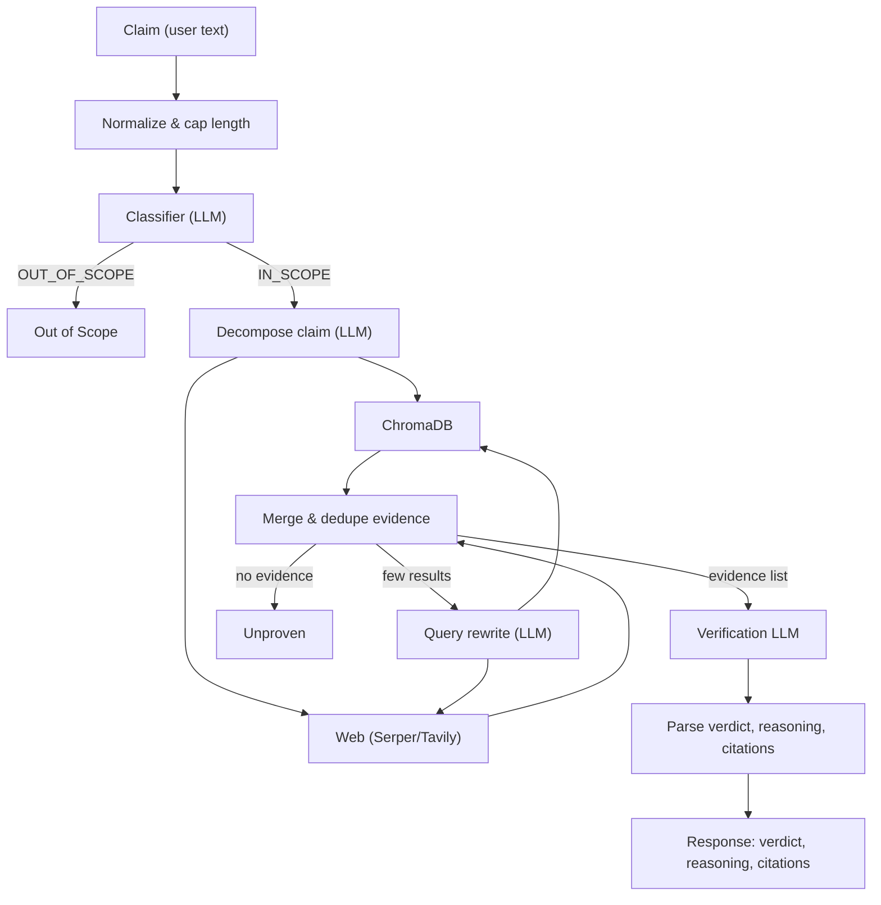

# Architecture: RAG + Agent Flow

This document describes the high-level architecture and data flow of the Real-Time News Claim Verification Assistant (agentic RAG pipeline + Chrome extension).

## System overview

```
┌─────────────────────────────────────────────────────────────────────────────────┐
│                           USER (browser)                                         │
│  Select text → Right-click "Verify claim" → Extension popup → Verify claim       │
└─────────────────────────────────────────────────────────────────────────────────┘
                                          │
                                          ▼
┌─────────────────────────────────────────────────────────────────────────────────┐
│  EXTENSION (Chrome Manifest V3)                                                   │
│  background.js (context menu) │ popup.js / popup.html (UI, POST /verify)         │
└─────────────────────────────────────────────────────────────────────────────────┘
                                          │
                                          ▼
┌─────────────────────────────────────────────────────────────────────────────────┐
│  BACKEND (FastAPI)                                                                │
│  main.py: POST /verify → run_verification_pipeline(claim)                         │
│  Response: verdict, reasoning, citations[], evidence_count, conflict_note, ...    │
└─────────────────────────────────────────────────────────────────────────────────┘
                                          │
                                          ▼
┌─────────────────────────────────────────────────────────────────────────────────┐
│  AGENTIC RAG PIPELINE (agent/pipeline.py)                                         │
│  See flow diagram below.                                                          │
└─────────────────────────────────────────────────────────────────────────────────┘
```

## RAG + Agent pipeline flow

The diagram below shows the verification pipeline from claim input to verdict and citations.



## Component map (RAG + agent)

| Component | File(s) | Role in pipeline |
|-----------|---------|------------------|
| **API** | `backend/main.py` | Receives claim, calls pipeline, returns structured response; safe Unproven on errors. |
| **Pipeline** | `backend/agent/pipeline.py` | Orchestrator: normalize → classify → decompose → retrieve (KB + web) → merge → optional rewrite retry → verify. |
| **Classifier (guardrail)** | `backend/agent/classifier.py` | Pre-retrieval LLM: IN_SCOPE vs OUT_OF_SCOPE. Headlines and factual claims in scope; opinions, greetings, direct questions out of scope. |
| **Decompose / Rewrite** | `backend/agent/llm_helpers.py` | Decompose long claim into 1–3 sub-claims; rewrite claim as search query for sparse-evidence retry. |
| **KB retrieval** | `backend/agent/retrieval.py` | Embed with sentence-transformers, query ChromaDB, return `{title, url, snippet}`. |
| **Web retrieval** | `backend/agent/web_retrieval.py` | Serper or Tavily API; same shape as KB results; merged in pipeline. |
| **Merge** | `backend/agent/retrieval.py` | `merge_evidence`: dedupe by URL and snippet fingerprint; cap total evidence. |
| **Verify** | `backend/agent/verify.py` | Single LLM call with claim + numbered evidence; Snopes-style verdict; parse VERDICT / REASONING / CITATIONS / CONFLICT / CONFIDENCE. |
| **Prompts** | `backend/agent/prompts.py` | System and user prompts for classifier, decompose, rewrite, verify. |
| **Knowledge base** | `backend/kb/ingest.py`, `sample_documents.py` | Offline: embed documents, index into ChromaDB; pipeline only reads. |
| **Extension** | `extension/` | Context menu, popup UI, HTTP client to backend `/verify`. |

## Data flow (simplified)

1. **Claim** → normalized string (trimmed, length-capped).
2. **Classifier** → IN_SCOPE or OUT_OF_SCOPE; OUT_OF_SCOPE exits with "Out of Scope".
3. **Decompose** → list of 1–3 query strings (or original claim).
4. **Retrieve** → for each query: ChromaDB + (if configured) web search → list of `{title, url, snippet}`.
5. **Merge** → single evidence list, deduped, capped (e.g. 20 items).
6. **Optional retry** → if evidence sparse, rewrite query → extra KB + web results merged in.
7. **Empty evidence** → return "Unproven", no LLM call.
8. **Verify LLM** → claim + numbered evidence in → VERDICT, REASONING, CITATIONS (indices), CONFLICT_MENTIONED, CONFIDENCE_NOTE.
9. **Response** → verdict, reasoning, citations (built only from cited indices), evidence_count, conflict_mentioned, confidence_note.

Citations are **never fabricated**: they are built strictly from retrieved evidence and the indices the LLM references.
